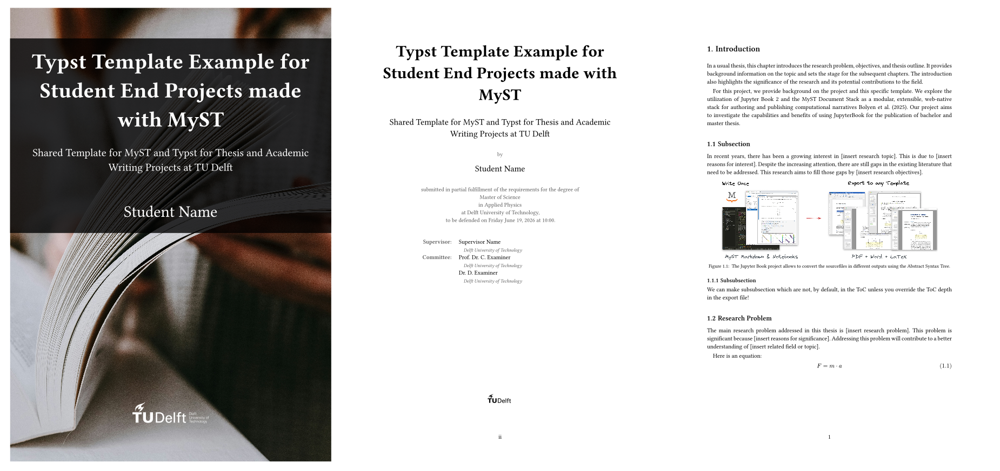

# **MyST to Typst** Template 
[](#)
[](LICENSE)

A minimalist, customisable Typst Template for Publishing Academic Thesis Reports with MyST.


With simple YAML options you can configure:

- **frontmatter** (style and content)
- **typography**
- **project customisations**





This template includes:

- Cover page, title page, colophon, abstract, front matter, table of contents, bibliography, and main matter layout.
- PDF options for page layout, typography, front matter, cover styling, and bibliography settings.
- Separate configuration files for document metadata, people, thesis-specific fields, and PDF export settings.
- A modular Typst code structure under `src/`, so layout components can be edited without working in one large template file.

## Quick Start

This template uses MyST for the document project and Typst for PDF rendering. It is configured to work seamlessly as a template for the [Starterkit of the JBOS project.](https://jboss.tudelft.nl//)

## Example

### PDF Export Options

Full set of export options is described in `example/typst_export_config.yml`:

```yaml
project:
  exports:
    - id: thesis-pdf
      format: typst
      template: ../
      output: ./exports/typst_template_example.pdf
```

### Project Metadata

Document metadata lives in `example/myst.yml`:

```yaml
project:
  title: MyST to Typst Manual and Template Example
  subtitle: A student guide to writing thesis projects with MyST and Typst
  bibliography:
    - reference.bib
```

The author's and supervisors' names live in `example/people.yml`:

```yaml
project:
  authors:
    - id: student
      name: Student Name
```

Fields that are not available by default in MyST, but are used in the rendering of the PDF live in `example/options.yml`:

```yaml
project:
  options:
    thesis_degree: Master of Science
    thesis_program: Applied Physics
```
 
## Repository Layout

```text
.
|-- template.yml                  # MyST template manifest and option declarations
|-- template.typ                  # Bridge from MyST data/options to Typst
|-- src/
|   |-- main.typ                  # Main Typst document assembly
|   |-- layout/
|   |   |-- cover.typ             # Cover page variants
|   |   |-- titlepage.typ         # Title page variants
|   |   |-- frontmatter.typ       # Abstract, preface, contents, lists
|   |   |-- colophon.typ          # Publication and colophon page
|   |   `-- bibliography.typ      # Bibliography rendering
|   `-- assets/                   # Default images, logos, and optional fonts
`-- example/
    |-- myst.yml                  # Example MyST project configuration
    |-- options.yml               # Thesis-specific project options
    |-- people.yml                # Authors, supervisors, committee members
    |-- typst_export_config.yml   # PDF export options
    `-- content/                  # Example document content
```

## Local builds
Clone, download or fork this repository, and run MyST builder from `example/`:

```powershell
myst build --typst
```

## License
This template is released under the MIT License. See LICENSE.